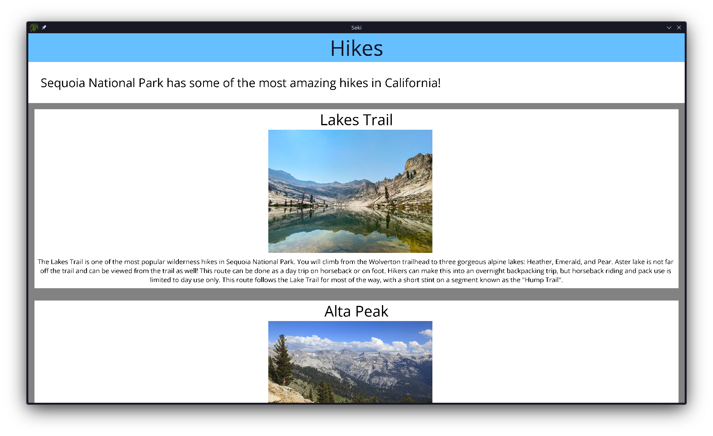

# Seki

In honor of exploring the beautiful Sequoia and King's Canyon front and backcountry, this is a simple Sierra Nevada themed HTML/CSS browser rendering engine!



## Features

- Basic HTML/CSS parsing
- Block DOM layouts
- Border/margin/padding edges & colors
- HTML Image Loading via libcurl
- Resizable Images
- Cascading Styles such as text color/background color, text alignment
- Mouse & Keyboard Scrolling

## Build

### Dependencies

- [libcurl openssl](https://curl.se/download.html)
  - Or simply install via your package manager

### Building Raylib

First build raylib. Go to lib/raylib/src/ and run

```
make PLATFORM=PLATFORM_DESKTOP
```

### Build Project

Navigate to the base directory and simply compile using

```
make -f desktop.mk
```

Then run by

```
./build/seki
```

## Resources

- [Toy Layout Engine](https://limpet.net/mbrubeck/2014/08/08/toy-layout-engine-1.html)
- [How Browsers Work](https://web.dev/articles/howbrowserswork)
